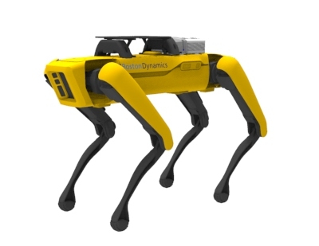

# Spot ROS Driver



## Prerequisite
```
pip3 install bosdyn-client bosdyn-mission bosdyn-api bosdyn-core
```


## Documentation

Check-out the usage and user documentation [HERE](http://www.clearpathrobotics.com/assets/guides/melodic/spot-ros/)
