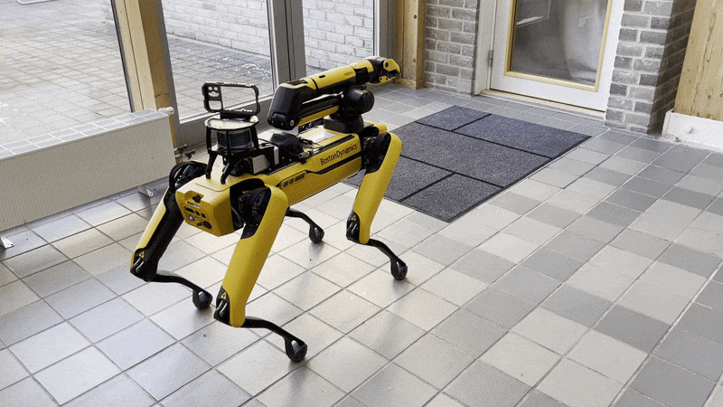
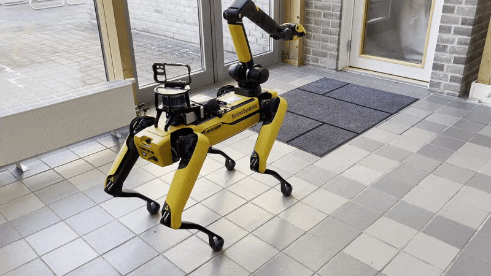

Arm Control
===========

The driver can also send commands to the robot's arm, if it has one. The following services
allow control of various parts of the arm. Note that the arm does not have collision avoidance,
so it is important to be careful when using these services.

+--------------------------+--------------------------------------------------------------------------------------------------------------------------------------------------------------------------------------------------------------------------------------------------------------------------+
|         Service          |                                                                                                                               Description                                                                                                                                |
+==========================+==========================================================================================================================================================================================================================================================================+
| /spot/arm_carry          | Move the arm into the `carry` position.                                                                                                                                                                                                                                  |
+--------------------------+--------------------------------------------------------------------------------------------------------------------------------------------------------------------------------------------------------------------------------------------------------------------------+
| /spot/arm_joint_move     | Move each joint into a position specified by a specific angle, corresponding to the `6 degrees of freedom <https://dev.bostondynamics.com/python/bosdyn-client/src/bosdyn/client/robot_command#bosdyn.client.robot_command.RobotCommandBuilder.arm_joint_move_helper>`_. |
+--------------------------+--------------------------------------------------------------------------------------------------------------------------------------------------------------------------------------------------------------------------------------------------------------------------+
| /spot/arm_stow           | Move the arm into the `stow` position.                                                                                                                                                                                                                                   |
+--------------------------+--------------------------------------------------------------------------------------------------------------------------------------------------------------------------------------------------------------------------------------------------------------------------+
| /spot/arm_unstow         | Move the arm into the `unstow` position.                                                                                                                                                                                                                                 |
+--------------------------+--------------------------------------------------------------------------------------------------------------------------------------------------------------------------------------------------------------------------------------------------------------------------+
| /spot/force_trajectory   | Move the arm by specifying forces in (x,y,z) linear forces and (rx,ry,rz) rotational forces, acting as a virtual wrench.                                                                                                                                                 |
+--------------------------+--------------------------------------------------------------------------------------------------------------------------------------------------------------------------------------------------------------------------------------------------------------------------+
| /spot/grasp_3d           | Use the `Pick` autonomy feature of Spot to pick an object specified in Cartesian (x,y,z) coordinates in a chosen reference frame, usually ``body``.                                                                                                                      |
+--------------------------+--------------------------------------------------------------------------------------------------------------------------------------------------------------------------------------------------------------------------------------------------------------------------+
| /spot/gripper_angle_open | Open the gripper to a specific angle, between 0 and 90 degrees.                                                                                                                                                                                                          |
+--------------------------+--------------------------------------------------------------------------------------------------------------------------------------------------------------------------------------------------------------------------------------------------------------------------+
| /spot/gripper_close      | Close the gripper to 0 degrees.                                                                                                                                                                                                                                          |
+--------------------------+--------------------------------------------------------------------------------------------------------------------------------------------------------------------------------------------------------------------------------------------------------------------------+
| /spot/gripper_open       | Open the gripper to 90 degrees.                                                                                                                                                                                                                                          |
+--------------------------+--------------------------------------------------------------------------------------------------------------------------------------------------------------------------------------------------------------------------------------------------------------------------+
| /spot/gripper_pose       | Move the gripper to a point specified in Cartesian (x,y,z) coordinates of the robot's ``body`` frame.                                                                                                                                                                    |
+--------------------------+--------------------------------------------------------------------------------------------------------------------------------------------------------------------------------------------------------------------------------------------------------------------------+

Arm Carry, Stow, Unstow
-----------------------

The arm can be moved into the predefined `carry`, `stow`, and `unstow` positions.

Carry:

Stow:

Pick Service (Grasp 3D)
-----------------------

Note that it is important to perform the Spot Check calibration before using the Pick service of the arm.
If any cameras are in an error state, the Spot robot will refuse to execute any Autonomy features, including picking.
The Picking process is shown below:

1. Walking to the object
2. Unstowing the arm
3. Surveying the object with the gripper camera
4. Walking closer to the object
5. Picking the object
6. Closing the gripper

.. image:: images/spot-grasp-3d.gif
