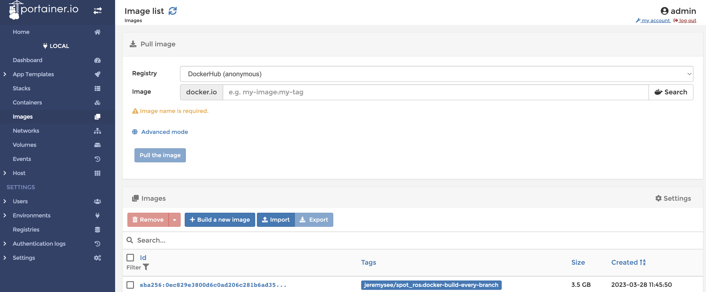

Docker Deployment
=================

It is recommended to deploy the ROS driver in a Docker container to the Spot CORE, or any computer carried by Spot.
The Spot CORE utilises Portainer to handle Docker containers, with a deployment guide `here <https://dev.bostondynamics.com/docs/payload/spot_core_portainer>`_.

The Dockerfile for the ROS driver is located in the ``deploy`` directory of the repository, building on the ROS
Noetic image. You can modify this to build your own image, or use the pre-built image from Docker Hub.

Deployment Steps
----------------

1. ``docker pull`` the image from Docker Hub
2. ``docker save`` the image to a tar file
3. Transfer the tar file to the Spot CORE, or any computer carried by Spot
4. Create a container from the image, using the ``docker run`` command or the Portainer interface

Portainer
---------

Portainer is a web interface for managing Docker containers. It is installed on the Spot CORE by default, and can be accessed
by navigating to ``192.168.80.3:21900`` in a web browser. Portainer has a `guide <https://docs.portainer.io/user/docker/dashboard>`_
on how to manage images and containers through its interface.

