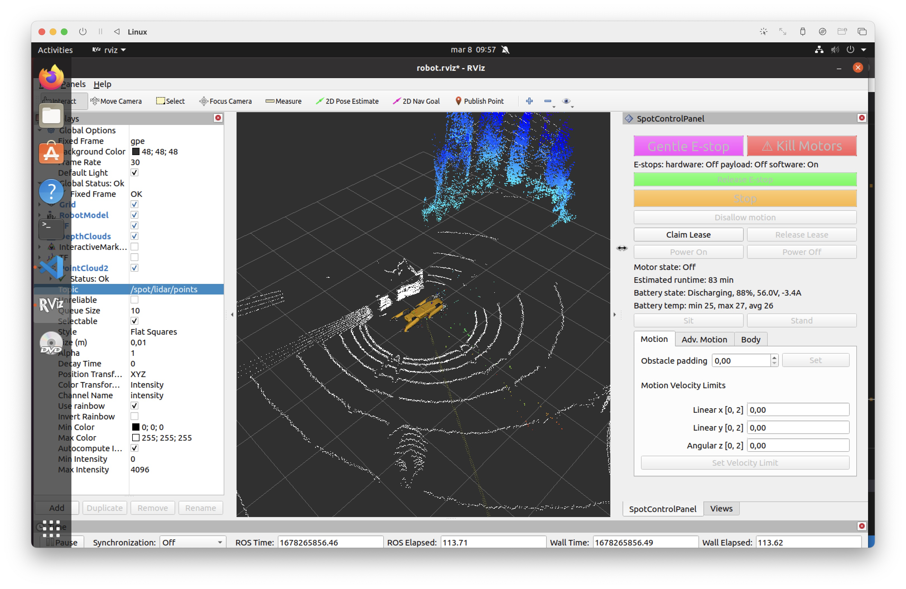

Spot EAP Usage
==========================================

The `Spot EAP package <https://support.bostondynamics.com/s/article/Spot-Enhanced-Autonomy-Package-EAP>`_ is a payload that
includes a Velodyne VLP-16 lidar. This allows it to generate point clouds of the surrounding environment. This ROS driver
allows you to retrieve the lidar data from the Spot SDK and publish it to ROS in the
`PointCloud2 <http://docs.ros.org/en/melodic/api/sensor_msgs/html/msg/PointCloud2.html>`_ format.

Hardware Setup
----------------

Follow `Boston Dynamics' instructions <https://dev.bostondynamics.com/docs/payload/readme>`_ for installing the Spot EAP package.
You will need to use one of the payload ports on the top of the robot (usually the rear one) to connect the lidar to the robot,
and register the payload with the controller or from the admin console web interface of the robot at ``192.168.80.3``.

Accessing the Point Cloud data
--------------------------------

Once the spot_driver has been started, you can access the point cloud data by subscribing to the ``/spot/lidar/points`` topic.
The point cloud data publishing rate can be configured using the ``spot_ros.yaml`` file in ``spot_driver`` package. The default
publishing rate is 10 Hz. This can be verified by running the following command.

.. code-block:: bash

    rostopic echo /spot/lidar/points
    rostopic hz /spot/lidar/points

The data can also be viewed in RViz. It is published in the ``sensor_msgs/PointCloud2`` format, in the ``odom`` frame of the robot.
An example of it in RViz is shown below, where the white dots represent points output from the lidar.

Note that this data has been filtered by the Spot SDK for localization usage, hence it is provided in the ``odom`` frame.
However, if you are using the point cloud data for other purposes, you may want to use the ``tf2`` package to transform it
into the ``base_link`` frame instead, using the ``tf2_sensor_msgs.do_transform_cloud()`` function.

Directly accessing the raw data
-----------------------------------

The data provided through the ``/spot/lidar/points`` topic is filtered by the Spot SDK for localization usage. If you want to
access the raw data, you can use a separate ROS package such as `velodyne_driver <http://wiki.ros.org/velodyne_driver>`_ to
access the data directly from the lidar.

Note that Boston Dynamics has claimed that this may `interfere <https://support.bostondynamics.com/s/article/Spot-Enhanced-Autonomy-Package-EAP>`_
with the Autowalk feature of Spot. The officially listed limitations of the EAP are:

::
    
    - Changing networking settings or otherwise interfering with the ``velodyne_service`` program on the EAP's Core will cause GraphNav not to function. 
    - Although point cloud data is published via the ``velodyne_service`` ``RemotePointCloud`` service, this data is heavily filtered for use with GraphNav. 
    - Users are free to access the VLP-16 sensor directly using its communication protocols; however, this likely interferes with its function in the ``velodyne_service`` which breaks Autowalk.
    - The EAP is not intended for reality capture applications as it currently designed. We recommend working with laser scanner companies such as Trimble for laser scanning and/or digital twin applications.