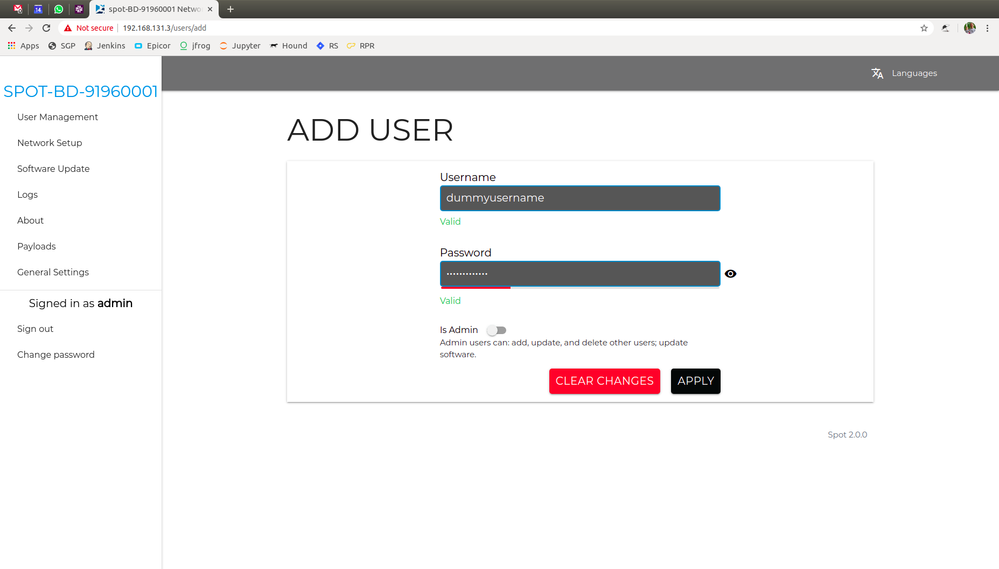
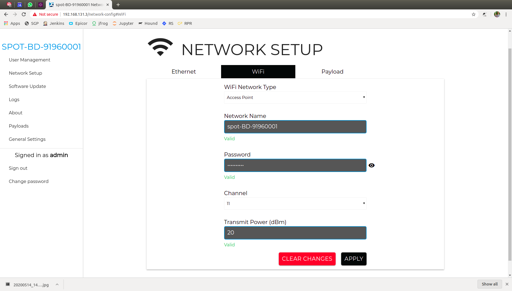

Spot Platform Configuration
===========================

.. note::
    This driver has only been fully tested up to version 2.0.1.  Any version after this may have unexpected behviour

.. _Spot Login:

Login to Spot as an Administrator
---------------------------------

Connect to the wireless access point created by the robot.  The data for this is inside the battery bay of the robot.  Once connected, login as the admin user by going to the robot's IP address (https://192.168.80.3) in your web browser and entering the admin login that is also available in the battery bay.

Check the Software Version
--------------------------

Currently, the Spot driver only supports API v1 data, but it is recommended to upgrade the robot to version 2.0 or later to get a number of improvements.

To check the current version of your robot, :ref:`Spot Login`, then press Software Update to see the current version.

.. image:: images/software_version.png

If your software is outdated, it is highly recommended to update using the process recommended by Boston Dynamics.

Create a New User (Optional)
----------------------------

For connecting to the robot with ROS, it is recommended to create a new, non-administrator user.  This allows for more security and user-management in the future.

To setup a new user, :ref:`Spot Login`, then navigate to the User Management page and press ADD USER.

Ender a valid username and password.  The user does not have to be an administrator to use the ROS driver.

Once your new user is setup, you will see it appear under the USER MANAGEMENT page.

.. image:: images/add_user_2.png

Setup Networking
----------------

There is a large amount of data that will be streaming to the robot over the network.  It is *highly recommended* to connect the Spot to the ROS PC through a gigabit ethernet interface.

Change your PC's IP address
~~~~~~~~~~~~~~~~~~~~~~~~~~~

If you are able to, you can set your computer’s IPaddress is in the range of 10.0.0.*, 10.0.0.100 for example.  The robot will be available on 10.0.0.3.

Setup Wi-Fi (Optional)
----------------------

Using wireless for ROS is not recommended.  There are cases where changing the robot's wireless settings an be useful.

.. note::

  This section is for referene only as there are some quirks with this wireless configuration.

First, :ref:`Spot Login`, and go to the Networking tab.  Choose WIFI

If you want to change the Access Point hosted by the robot, it can be configured here.  The following steps assume you are trying to connect the robot to an existing network.

Change the network type to Client and enter a valid IP address.  Make sure the IP you choose is:

* Different than your ROS PC's IP
* Different from all network sensor IPs
* Outside of DHCP range for any DHCP server in your network
* Not in the reserved ranges noted above

Set the Route Prefix to match your network.  This is commonly called the "netmask".  You will also want to set the Stored Default Route address correctly or you will likely have network issues.

.. image:: images/wifi_2.png

Once that is setup, go back to the Ethernet tab and set your DNS nameservers.  This is a global setting, not speific to WiFi.

You will also want to disabble "Is Current Default Route" under the Ethernet tab and enable it under the WIFI tab.

.. image:: images/wifi_3.png
