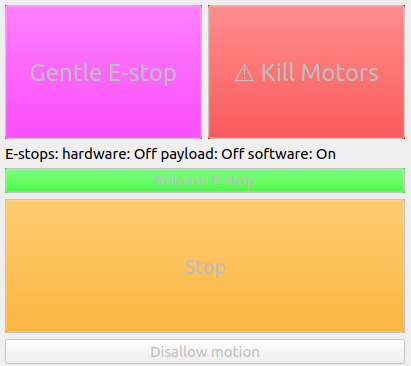
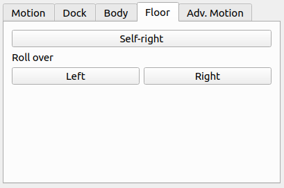
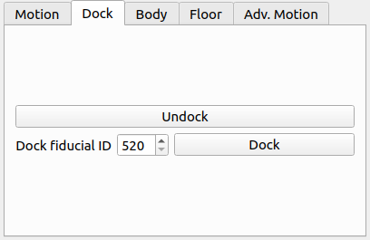
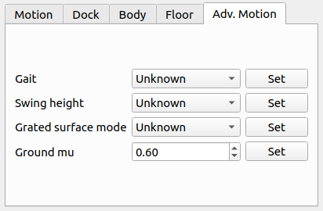

Basic Driver Usage
==================

.. warning::

  Before doing anything with the robot, you should read the Boston Dynamics `safety guidelines <https://d3cjkvgbik1jtv.cloudfront.net/Spot%20IFU/spot_information_for_use_EN_v1.1.pdf>`_.

.. note::

  Details of how the robot functions can be found in the `Boston Dynamics SDK documentation <https://dev.bostondynamics.com>`_.

Verify the URDF
---------------

To verify that the spot_viz and spot_description packages are sourced properly, you can run

.. code:: bash

  roslaunch spot_viz view_model.launch

This will load RVIZ with the robot description visible.  It should also show any additions you may have added to the robot's URDF

.. image:: images/view_model.png

Configure your networking
-------------------------

If your ROS machine is attached to a payload port you will need to configure it so that it can connect to spot. See `payload network configuration <https://support.bostondynamics.com/s/article/Payload-device-network-configuration>`_ for more details.

Running the driver
------------------

.. code:: bash

  roslaunch spot_driver driver.launch

When launching, there are some options you may need to configure for your setup:

+----------------------+---------------+-------------------------------------------------------------------+
|Argument              |Default        |Description                                                        |
+======================+===============+===================================================================+
|username              |dummyusername  |Use this username to authenticate with spot                        |
+----------------------+---------------+-------------------------------------------------------------------+
|password              |dummypassword  |Use this password to authenticate with spot                        |
+----------------------+---------------+-------------------------------------------------------------------+
|hostname              |192.168.50.3   |The IP address at which spot can be found                          |
+----------------------+---------------+-------------------------------------------------------------------+
|estop_timeout         |9.0            |Time allowed before rpc commands will time out. Comms between the  |
|                      |               |robot and driver are checked at a rate of 1/3 of this time. If     |
|                      |               |comms are down, a gentle estop will trigger                        |
+----------------------+---------------+-------------------------------------------------------------------+
|autonomy_enabled      |True           |If false, some autonomy commands will be disabled for this run of  |
|                      |               |the driver. This can only be changed on driver restart             |
|                      |               |                                                                   |
+----------------------+---------------+-------------------------------------------------------------------+
|max_linear_velocity_x |0              |Limit on linear velocity for moving forwards. 0 is whatever is     |
|                      |               |specified by BD.                                                   |
|                      |               |                                                                   |
+----------------------+---------------+-------------------------------------------------------------------+
|max_linear_velocity_y |0              |Limit on linear velocity for moving sideways. 0 is whatever is     |
|                      |               |specified by BD.                                                   |
|                      |               |                                                                   |
+----------------------+---------------+-------------------------------------------------------------------+
|max_linear_velocity_z |0              |Limit on angular velocity for rotation. 0 is whatever is specified |
|                      |               |by BD.                                                             |
|                      |               |                                                                   |
+----------------------+---------------+-------------------------------------------------------------------+
|allow_motion          |True           |If false, the robot starts with all motion disallowed and must have|
|                      |               |it enabled by calling a service or pressing a button in rviz       |
|                      |               |                                                                   |
+----------------------+---------------+-------------------------------------------------------------------+

View the robot
--------------

Once the robot is connected, you should be able to visualize its odometry, joint positions, camera streams, etc.
using rviz.  To view these streams, run

.. code:: bash

  roslaunch spot_viz view_robot.launch

Once RVIZ is loaded, you should see something similar to this.

.. image:: images/view_robot.png

Taking control of the robot
---------------------------

The easiest way to control the robot is through the rviz control panel, which connects to the various ROS services.
Many commands which can be executed using a service or topic can also be executed using the panel. To add the panel
to rviz go to Panels>Add new panel and the select ``SpotControlPanel`` under ``spot_viz``. It is included by default
in the ``view_robot`` launch file.

.. image:: images/rviz_panel.png

Holding the lease
~~~~~~~~~~~~~~~~~

A body lease gives the holder the ability to command the spot to make actions in the world.

There are two ways to claim a body lease and eStop using this driver.

#. Automatically when the driver starts by enabling the ``auto_claim`` variable
#. By calling the ``/spot/claim`` service after the driver is started

You cannot claim a lease on the robot if something else already has a lease. This is for security and safety reasons.
Check the``status/leases`` topic for information on current leases.

You can release the lease by calling the ``/spot/release`` service.

.. warning::

  Releasing the lease while the robot is standing will trigger a gentle estop.

Holding a lease automatically establishes an estop connection to the robot.

All buttons except the claim lease button on the rviz panel are disabled if the ROS driver does not hold the lease.

Emergency stops
~~~~~~~~~~~~~~~

The estop connection gives the robot a way to guarantee that the commanding system is maintaining contact with the
robot. If this contact is lost, the robot will perform a gentle stop. The gentle and hard estops are calling through
to the BD SDK.

The gentle stop is at ``/spot/estop/gentle``. It stops all motion of the robot and commands it to sit. This stop does
not have to be released.

.. warning::

  The hard estop immediately cuts power to the motors. The robot may collapse in an uncontrolled manner.

The hard estop is at ``/spot/estop/hard`` this will kill power to the motors and must be released before you can send
any commands to the robot. To release the estop, call ``/spot/estop/release``.

There is an additional service ``/spot/stop`` which is implemented by the driver. This service stops any command that
is currently being executed. The ``/spot/locked_stop`` stops the current command and also disallows any further motion
of the robot. Motion can be allowed again by calling the ``/spot/allow_motion`` service.

The top of the rviz panel has buttons to control the estops as described above, and also displays their status. It
also shows whether the robot is allowed to move or not.

Enable motor power
~~~~~~~~~~~~~~~~~~

Motor power needs to be enabled once you have a Lease on the body.  This can be done in two ways:

#. Automatically when the driver starts by enabling the ``auto_power_on`` variable
#. By calling the ``/spot/power_on`` service after the driver is started

Stand the robot up
~~~~~~~~~~~~~~~~~~

Once the motors are powered, stand the robot up so it is able to move through the world.  This can be done in two ways:

#. Automatically when the driver starts by enabling the ``auto_stand`` variable
#. By calling the ``/spot/stand`` service after the driver is started

Controlling the velocity
------------------------

.. warning::

  Spot will attempt to avoid any obstacles it detects with its cameras, but no vision or actuation system is perfect.  Make sure to only move the robot in a safe area and in a controlled manner.

Topic
~~~~~~~~~~

To control Spot, you can send a Twist message to command a velocity.

.. code:: bash

  rostopic pub /spot/cmd_vel geometry_msgs/Twist "linear:
    x: 0.0
    y: 0.0
    z: 0.0
  angular:
    x: 0.0
    y: 0.0
    z: 0.3" -r 10

That command will have spot rotate on the spot at 0.3 radians/second.  Note the -r at the end of the command.  That has ROS resend the message over again.  If you don't resend the message, the driver will assume a timeout and stop commanding motion of the robot.

Controlling the body
--------------------

There are two different ways of specifying the pose of the body.

Static body pose
~~~~~~~~~~~~~~~~

The static body pose changes the body position only when the robot is stationary. Any other motion will reset the
body to its normal pose. It can adjust the roll, pitch, yaw, and body height.

Service
^^^^^^^

The body can be posed by a service call to ``/spot/posed_stand``.

If using a pose message, you can control the body height by setting the z component of position. The x and y
components of position are ignored. If the pose message is non-zero, any roll/pitch/yaw specification will be ignored.

If using the roll/pitch/yaw specification, enter values in degrees, and body height in metres. Body height is based
on displacement from the neutral position.

If you send an empty message, the body pose will be reset to neutral.

Actionserver
^^^^^^^^^^^^

The actionserver ``/spot/body_pose`` can be called to set the body pose.

To test this, start an action client with

.. code:: bash

  rosrun actionlib_tools axclient.py /spot/body_pose

You will see a window pop up, and you can specify the body pose with a Pose message, or by specifying roll, pitch and
yaw, and a body height.

Here is what the axclient window will look like:

.. code:: yaml

    body_pose:
      position:
        x: 0.0
        y: 0.0
        z: 0.0
      orientation:
        x: 0.0
        y: 0.0
        z: 0.0
        w: 0.0
    roll: 0
    pitch: 0
    yaw: 0
    body_height: 0.0

Rviz
^^^^

The static pose can also be controlled in the body tab.

.. image:: images/rviz_body_tab.png

In-motion body pose
~~~~~~~~~~~~~~~~~~~

.. warning::

  The in-motion body pose can affect the stability of the robot while walking.

It is also possible to specify a pose the robot should hold while it is in motion. This is a more restricted version
of the static body pose and cannot achieve the same body heights or rotational changes. While idle, all the
parameters specified will be held. The pitch and body height are maintained throughout any walking motion
the robot makes. When the robot stops walking, it will return to the pose specified by all parameters.

Topic
^^^^^

This pose can be set through the ``/spot/in_motion_or_idle_body_pose`` topic

.. code:: bash

  rostopic pub /spot/in_motion_or_idle_body_pose geometry_msgs/Pose "position:
    x: 0.0
    y: 0.0
    z: 0.0
  orientation:
    x: 0.0
    y: 0.0
    z: 0.0
    w: 1.0"

Actionserver
^^^^^^^^^^^^

The actionserver is found at ``/spot/motion_or_idle_body_pose`` and has the same parameters as the static pose.

Moving to a pose
----------------

.. warning::

  Take into account the Boston Dynamics `safety guidelines <https://d3cjkvgbik1jtv.cloudfront.net/Spot%20IFU/spot_information_for_use_EN_v1.1.pdf>`_ when moving the robot. The robot will attempt to avoid obstacles but will also walk over any uneven terrain, regardless of what that terrain is made up of. You should operate in a controlled environment.

One of the most important commands for easily controlling the robot is the trajectory command. This command allows
you to move the robot to a position in space by specifying a pose relative to the robot's current position. You may
specify a pose in a different frame than the ``body`` frame and it will be transformed into that frame.

ROS Topic
~~~~~~~~~

The ``/spot/go_to_pose`` topic can be used to move the robot by specifying a pose.

The following command will move the robot one metre forwards from its current location.

.. code:: bash

    rostopic pub /spot/go_to_pose geometry_msgs/PoseStamped "header:
      seq: 0
      stamp:
        secs: 0
        nsecs: 0
      frame_id: 'body'
    pose:
      position:
        x: 1
        y: 0.0
        z: 0.0
      orientation:
        x: 0.0
        y: 0.0
        z: 0.0
        w: 1"

Actionserver
~~~~~~~~~~~~

The ``/spot/trajectory`` actionserver gives you a little more control than the ros topic, and will also give you
information about success or failure.

.. warning::

    If there is an obstacle along the trajectory the robot is trying to move along, it may fail as the trajectory command
    is different to the command that is used by the controller. In this case, the actionserver will return success
    despite not actually reaching the requested pose.

    As of 2021/09/10 the boston dynamics API does not appear to provide
    feedback which we can use to return failure when this happens.

In addition to the pose, you can specify ``duration``, which specifies how long the command can run before timing out.

The ``precise_positioning`` variable can be used to request that the robot move more precisely to the specified pose.
If set to false, the robot will move to "near" the specified pose. It's not clear what exactly defines being "near"
to the pose, but you should not expect to reach the pose precisely. The robot will end up within ~0.5m of the pose,
and not make much effort to align to the orientation.

You can test the actionserver by using an action client

.. code:: bash

  rosrun actionlib_tools axclient /spot/trajectory

And fill in the values as you like.

Rviz
~~~~

You can connect the 2d nav goal tool to publish to the ``/spot/go_to_pose`` topic. The default rviz config provided with

.. code:: bash

  roslaunch spot_viz view_robot.launch

Already has the tool configured, but you can also do this by right clicking the toolbar, selecting tool properties,
then changing the nav goal topic to ``/spot/go_to_pose``.

Setting velocity limits
-----------------------

You can set a velocity limit in m/s for the motion to poses using the ``/spot/velocity_limit`` service:

.. code:: bash

    rosservice call /spot/velocity_limit "velocity_limit:
      linear:
        x: 0.0
        y: 0.0
        z: 0.0
      angular:
        x: 0.0
        y: 0.0
        z: 0.0"

Only the x and y components of linear velocity are considered, and the z component of angular.

You can adjust the velocity limits on startup by setting the max linear/angular velocity params.

You can also set the limits using the rviz panel.

.. image:: images/rviz_motion_tab.png

Cameras and Depth Clouds
------------------------

Spot is equipped 5 RGB and depth-sensing cameras: 2 on the front, one on each side, and one in the rear.  All of these
cameras publish at approximately 10Hz.

Note that the front cameras are mounted sideways, so they have a narrower horizontal FoV, but a larger vertical one.
The camera data likewise rotated anticlockwise by 90 degrees.

The ``frontleft`` camera and depth topics are from the camera physically located on the front-left of the robot.
This camera is pointed to the robot's right, so the depth cloud will appear in front of the robot's right shoulder:

.. image:: images/front-left-depth.png

Similarly the ``frontright`` camera and depth topics are from the camera physically located on the front-right of the
robot.  This camera points to the robot's left, so the depth cloud will appear in front of the robot's left shoulder:

.. image:: images/front-right-depth.png

The complete list of depth and camera topics is below:

+--------------------------------+----------------------------+-------------------------------------------------------+
| Topic                          | Type                       | Comments                                              |
+================================+============================+=======================================================+
| camera/frontleft/camera/image  | Image                      | Data from the front-left camera, which points to the  |
|                                |                            | right. Image is rotated 90 degrees anticlockwise.     |
+--------------------------------+----------------------------+-------------------------------------------------------+
| camera/frontright/camera/image | Image                      | Data from the front-right camera, which points to the |
|                                |                            | left. Image is rotated 90 degrees anticlockwise.      |
+--------------------------------+----------------------------+-------------------------------------------------------+
| camera/left/camera/image       | Image                      |                                                       |
+--------------------------------+----------------------------+-------------------------------------------------------+
| camera/right/camera/image      | Image                      |                                                       |
+--------------------------------+----------------------------+-------------------------------------------------------+
| camera/back/camera/image       | Image                      |                                                       |
+--------------------------------+----------------------------+-------------------------------------------------------+
| depth/frontleft/camera/image   | Image                      | Data from the front-left camera, which points to the  |
|                                |                            | right.                                                |
+--------------------------------+----------------------------+-------------------------------------------------------+
| depth/frontright/camera/image  | Image                      | Data from the front-right camera, which points to the |
|                                |                            | left.                                                 |
+--------------------------------+----------------------------+-------------------------------------------------------+
| depth/left/camera/image        | Image                      |                                                       |
+--------------------------------+----------------------------+-------------------------------------------------------+
| depth/right/camera/image       | Image                      |                                                       |
+--------------------------------+----------------------------+-------------------------------------------------------+
| depth/back/camera/image        | Image                      |                                                       |
+--------------------------------+----------------------------+-------------------------------------------------------+

Self righting and roll over
---------------------------

.. warning::

    Self righting and battery charging may or may not take into account payloads configured on the robot. Test with your
    configuration before using.

The self-right command can be accessed through ``/spot/self_right``.

The roll over commands can be accessed through the ``/spot/roll_over_left`` and ``/spot/roll_over_right`` services.

You can also access these actions through rviz.

Autonomous docking
------------------

.. note::

  See Boston Dynamics support for information about `setting up the dock <https://support.bostondynamics.com/s/article/Spot-Dock-setup>`_.

If using a Spot Enterprise, you will have access to autonomous docking capabilities.

Services
~~~~~~~~

You can trigger undocking with ``/spot/undock``.

Docking can be triggered with ``/spot/dock``. You must provide the fiducial ID of the dock the robot should dock at.

Actionserver
~~~~~~~~~~~~

Docking can also be performed using a single actionserver at ``/spot/dock``. To undock, the ``undock`` variable should
be set to true. Docking is the default action and requires specification of the fiducial ID in the ``dock_id`` variable.

Rviz
~~~~

You can also perform docking through the dock tab.

Advanced motion control
-----------------------

There are other parameters that can be used to specify the behaviour of the robot. These allow for more granular
control of specific things. You should read and understand the SDK documentation before using these services to alter
any of these parameters.

* `/spot/swing_height <https://dev.bostondynamics.com/protos/bosdyn/api/proto_reference.html?highlight=power_state#swingheight>`_
* `/spot/terrain_params <https://dev.bostondynamics.com/protos/bosdyn/api/proto_reference.html?highlight=power_state#terrainparams>`_
* `/spot/locomotion_mode <https://dev.bostondynamics.com/protos/bosdyn/api/proto_reference.html?highlight=mobilityparams#locomotionhint>`_
* `/spot/obstacle_params  <https://dev.bostondynamics.com/protos/bosdyn/api/proto_reference.html?highlight=power_state#obstacleparams>`_

Some of the more advanced motion controls can be accessed through the advanced motion tab.

Monitoring
----------

There are various topics which output information about the state of the robot:

+------------------------+----------------------------+---------------------------------------------------------+
| Topic                  | Type                       | Description                                             |
+========================+============================+=========================================================+
| status/metrics         | Metrics                    | General metrics for the system like distance walked     |
+------------------------+----------------------------+---------------------------------------------------------+
| status/leases          | LeaseArray                 | A list of what leases are held on the system            |
+------------------------+----------------------------+---------------------------------------------------------+
| odometry/twist         | TwistWithCovarianceStamped | The estimated odometry of the platform                  |
+------------------------+----------------------------+---------------------------------------------------------+
| status/feet            | FootStateArray             | The status and position of each foot                    |
+------------------------+----------------------------+---------------------------------------------------------+
| status/estop           | EStopStateArray            | The status of the eStop system                          |
+------------------------+----------------------------+---------------------------------------------------------+
| status/wifi            | WiFiState                  | Status of the wifi system                               |
+------------------------+----------------------------+---------------------------------------------------------+
| status/power_state     | PowerState                 | General power information                               |
+------------------------+----------------------------+---------------------------------------------------------+
| status/battery_states  | BatteryStateArray          | Information for the battery and all cells in the system |
+------------------------+----------------------------+---------------------------------------------------------+
| status/behavior_faults | BehaviorFaultState         | A listing of behavior faults in the system              |
+------------------------+----------------------------+---------------------------------------------------------+
| status/system_faults   | SystemFaultState           | A listing of system faults in the system                |
+------------------------+----------------------------+---------------------------------------------------------+
| status/feedback        | Feedback                   | Feedback from the Spot robot                            |
+------------------------+----------------------------+---------------------------------------------------------+
| status/mobility_params | MobilityParams             | Describes the current state of the mobility parameters  |
|                        |                            | defining the motion behaviour of the robot              |
+------------------------+----------------------------+---------------------------------------------------------+

Troubleshooting
---------------

These instructions are a minimum subset of instructions to get this driver working and do not contain all necessary
debugging steps.  Please refer to the `Spot SDK Quickstart <https://github.com/boston-dynamics/spot-sdk/blob/master/docs/python/quickstart.md>`_ for more detailed debugging steps.
